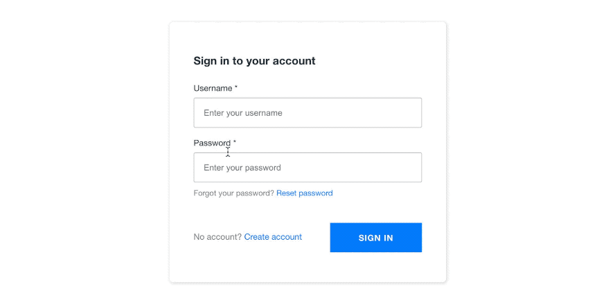

## Real Time Chat with React, GraphQL, and AWS AppSync

This application utilizes the CDK and [cdk-appsync-transformer](https://github.com/kcwinner/cdk-appsync-transformer) to combine the CDK 
and Amplify into a pretty nice backend workflow.
#### Original Amplify Version

https://github.com/full-stack-serverless/react-chat-app-aws

#### Original CDK Version

https://github.com/full-stack-serverless/cdk-appsync-chat

### Deploying

1. Clone the repo and change into the directory:

```sh
git clone https://github.com/thefinnomenon/amplify-the-cdk.git && cd $_
```

2. Install the dependencies:

```sh
npm install
```

3. Deploy the back end

```sh
npm run backend:deploy
```

4. Start the app

```sh
npm start
```